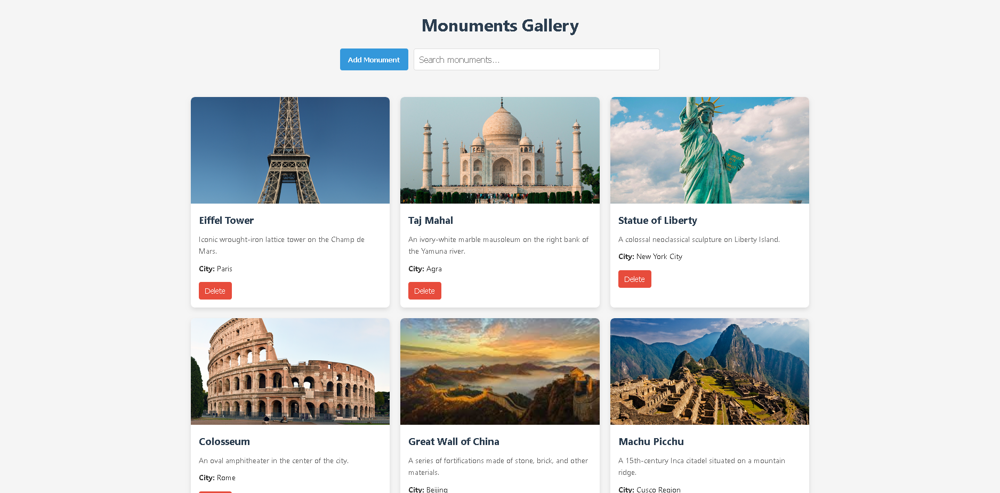

# Monuments Gallery

A React application for displaying and managing monument information in a responsive grid layout.



## Features

- **3x3 Grid Layout**: Display monuments in an organized, responsive grid.
- **Add Monuments**: Add new monuments with name, description, and city information.
- **Edit Functionality**: Click on any monument image to edit its details.
- **Delete Option**: Remove monuments from the gallery with a single click.
- **Search Capability**: Filter monuments by name using the search bar.
- **Responsive Design**: Works on desktop and mobile devices.

## Technologies Used

- React.js
- CSS3
- JavaScript (ES6+)

## Installation

Follow these steps to set up the project locally:

```bash
# Clone the repository
git clone https://github.com/samarthpatel24/monuments-gallery.git

# Navigate to project directory
cd monuments-gallery

# Install dependencies
npm install

# Start development server
npm start
```

The application will open in your default browser at [http://localhost:3000](http://localhost:3000).

## Project Structure

```
monuments-gallery/
├── public/
├── src/
│   ├── components/
│   │   ├── MonumentCard.js    # Individual monument display
│   │   ├── MonumentForm.js    # Form for adding/editing monuments
│   │   ├── MonumentGrid.js    # Grid layout for monuments
│   │   └── SearchBar.js       # Search functionality
│   ├── App.css                # Main styles
│   ├── App.js                 # Main application component
│   └── index.js               # Entry point
└── package.json               # Dependencies and scripts
```

## Usage

1. **View Monuments**: Browse the gallery to see all monuments with their details.
2. **Add a Monument**: Click the "Add Monument" button and fill in the required information.
3. **Edit a Monument**: Click on any monument image to modify its details.
4. **Delete a Monument**: Use the delete button below each monument to remove it.
5. **Search**: Use the search bar to filter monuments by name.


## Author

Samarth Patel

## Acknowledgements

- Images provided by [Picsum Photos](https://picsum.photos)
- React.js documentation and community
